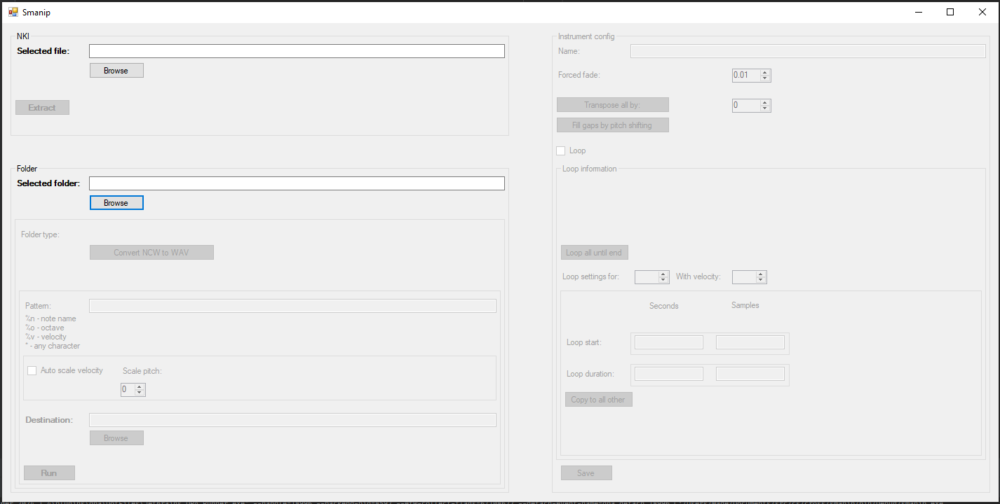

## About the project
The project was started on 25/6/2025.

This project can be used to manipulate Kontakt NKI and NCW files:
- extract samples and metadata from NKI files
- pitch shift those samples
- resample those samples
- convert the NKI files to my own private format (used in the synth project for debugging)

